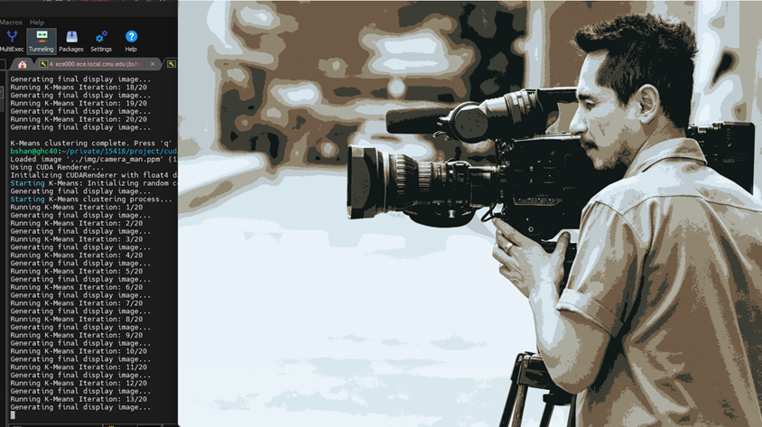

# Parallelized-K-means-Image-Segmentation (15418 Fall 2025 Project)

[](https://opensource.org/licenses/MIT)


## Description

 We implemented K-means clustering image segmentation in CUDA on GPU and in OpenMP on the CPU and compared the performance of non-optimized versions with these two parallelized versions. Our implementation demonstrated significant speedups. We also parallelized the initialization step of K-means++ in CUDA, and implemented a CUDA based image renderer that can run CUDA and OpenMP implementations of K-means clustering segmentation on image for every frame.

 Authors: Bert Shan, Charlotte Li




## Table of Contents

- [Features](#features)
- [Prerequisites](#prerequisites)
- [Usage](#usage)
- [Performance](#performance)
- [Image Results](#image-results)
- [Contributing](#contributing)
- [License](#license)


## Features

-   **K-means Clustering:** Segments images by partitioning pixels into K clusters based on color.
-   **CPU Parallelization:** Utilizes OpenMP to accelerate the clustering algorithm on multi-core CPUs.
-   **GPU Parallelization:** Implements a highly parallel version of the algorithm using CUDA to leverage the power of NVIDIA GPUs.
-   **K-means++ Initialization:** Includes a parallelized implementation of the K-means++ algorithm in CUDA to select better initial cluster centroids and improve convergence.
-   **Image Segmentation Renderer:** A real-time renderer built with CUDA that can run and visualize the segmentation process for sequential, OpenMP, and CUDA implementations frame-by-frame.

## Prerequisites

We used NVIDIA GeForce RTX 2080 B GPUs for implementations and testing. Any platform
with NVIDIA GPU should work. Make sure the platform has NVIDIA CUDA Toolkit (including the nvcc compiler)

If running OpenMP implementation, check how many cores are available on the CPU platform
A C++ compiler with OpenMP support (e.g., modern GCC).

## Usage

1.  **Running the Renderer**

    Clone the respository

    ```bash
    git clone https://github.com/BLS1202/Parallelized-K-means-Image-Segementation.git
    ```

    To run the renderer:

    ```bash
    cd cuda_renderer
    make    
    ./cuda_renderer/kmeans_visualizer <mode> <path/to/image.jpg>
    ```

    For <mode> select between "simple", "cuda" and "openmp"
    simple: Runs the sequential CPU version.
    cuda: Runs the CUDA GPU version.
    openmp: Runs the OpenMP parallel CPU version

2. **Running Testing Programs**

    Programs that test performance are in the code directory

    Here is an example to run a simple CPU version:

    ```bash
    cd code
    g++ -c k_mean_image.cpp libraries/Image.cpp
    g++ k_mean_image.o Image.o -o k_means_normal
    .k_means_normal ./img/input.jpg ./img/output_cpu.jpg
    ```

    To run Cuda files:

    ```bash
    cd code
    g++ -c libraries/Image.cpp -o Image.o
    nvcc -c k_mean_memory.cu -o k_mean_memory.o
    nvcc Image.o k_mean_memory.o -o k_means_memory

    ./k_means_memory <path/to/input_image.jpg> <path/to/output_image.jpg>
    ```

    To run OpenMP implementations:

    ```bash
    cd code
    g++ -c libraries/Image.cpp -o Image.o
    g++ -c k_mean_image_openmp1.cpp -fopenmp
    g++ Image.o k_mean_image_openmp1.o -fopenmp -o k_mean_image_openmp1

    ./k_mean_image_openmp1 <num_threads> <path/to/input_image.jpg> <path/to/output_image.jpg>
    ```

    More details for compile and running the files can be found in compile_commands.txt


## Performance

We tested our implementations on a **GHC machine** (8 cores, NVIDIA RTX 2080 B) and a **PSC machine** (128 cores). Below is a summary of our findings regarding speedup and scalability.

### OpenMP (CPU)
We implemented two versions: one using **Atomic operations** and one using **Reduction**. The Reduction method significantly outperformed the Atomic method by avoiding critical section bottlenecks.

*   **Speedup:** On an 8-core machine, the Reduction method achieved approximately **7.5x speedup** over the sequential version.
*   **Scalability:** Speedup increases with thread count, though overhead limits gains beyond the physical core count.

### CUDA (GPU)
We optimized memory access using **Shared Memory** and implemented a two-stage parallel reduction for centroid updates.

*   **Speedup:** The shared memory optimization provided massive improvements, reaching over **700x speedup** compared to the sequential CPU version for 8 clusters.
*   **Cluster Scalability:** Unlike the CPU version, increasing the number of clusters ($K$) had minimal impact on execution time due to the massive parallelism of the GPU.
*   **K-means++:** Our parallelized K-means++ initialization achieved up to **90x speedup** (for $K=16$) compared to sequential initialization.

### Speedup Comparison

The table below summarizes the speedup achieved by different implementations compared to the sequential baseline.

| Implementation | Optimization Technique | Speedup (vs Sequential) |
| :--- | :--- | :--- |
| **OpenMP** (8 threads) | Atomic Operations | ~4.0x |
| **OpenMP** (8 threads) | Reduction | ~7.5x |
| **CUDA** | Basic Global Memory | ~120x |
| **CUDA** | Shared Memory | ~700x |

## Image Results

Below is a comparison of the original input images and the resulting segmented images processed by our algorithm.

| Original Image | Segmented Image (K=8) |
| :---: | :---: |
| **Camera Man**<br> | **Segmented**<br> |
| **Lego**<br> | **Segmented**<br> |
| **Box**<br> | **Segmented**<br> |

## Contributing
Contributions are welcome! Please feel free to submit a Pull Request.

## License
This project is licensed under the MIT License - see the LICENSE file for details.
